# AWS ECR Build, Scan, Push & Deploy Workflow

Este repositorio contiene un flujo de trabajo reutilizable de GitHub Actions (`.github/workflows/build_scan_push_img.yml`) diseñado para construir, escanear y desplegar imágenes Docker en AWS.

## 🚀 Características

Este workflow automatiza las siguientes tareas de CI/CD:

1.  **Análisis de Código Estático (SAST)**: Escanea el código fuente en busca de vulnerabilidades y secretos expuestos utilizando **Trivy** (modo filesystem).
2.  **Construcción de Imagen**: Construye la imagen Docker.
3.  **Escaneo de Imagen**: Escanea la imagen construida en busca de vulnerabilidades de sistema operativo y librerías utilizando **Trivy**.
4.  **Publicación (Push)**: Sube la imagen a Amazon Elastic Container Registry (ECR).
5.  **Despliegue (Deploy)**: Actualiza la definición de tarea de Amazon ECS y despliega el servicio.
6.  **Notificaciones**: Envía el estado del workflow a Slack y Google Chat.

## 📋 Requisitos Previos

Para utilizar este flujo de trabajo, debes configurar los siguientes **Secretos** en tu repositorio o entorno de GitHub:

| Nombre del Secreto | Descripción |
| :--- | :--- |
| `AWS_ACCESS_KEY_ID` | ID de clave de acceso IAM con permisos para ECR y ECS. |
| `AWS_SECRET_ACCESS_KEY` | Clave de acceso secreta IAM. |
| `AWS_REGION` | Región de AWS (ej. `us-east-1`). |
| `AWS_ACCOUNT_ID` | ID de la cuenta de AWS. |
| `ECR_REPOSITORY` | Nombre del repositorio en ECR. |
| `CONTAINER_NAME` | Nombre del contenedor definido en la Task Definition de ECS. |
| `ECS_SERVICE` | Nombre del servicio ECS a actualizar. |
| `ECS_CLUSTER` | Nombre del clúster ECS. |
| `ECS_TASK_DEFINITION` | Nombre de la familia de la Task Definition o ARN. |
| `SLACK_WEBHOOK_URL` | (Opcional) Webhook para notificaciones en Slack. |
| `GOOGLE_CHAT_WEBHOOK_URL` | (Opcional) Webhook para notificaciones en Google Chat. |

## 🛠️ Uso

Puedes invocar este workflow desde otro workflow en tu repositorio usando `workflow_call`:

```yaml
name: Deploy AWS 

on:
  push:
    branches: [ "main" ]
  workflow_dispatch:

jobs:
  deploy:
    uses: Fundacion-Dinero-Conciencia/github-template/.github/workflows/build_scan_push_img.yml@v9
    with:
      environment: pro
    secrets:
      AWS_REGION: ${{ secrets.AWS_REGION }}
      AWS_ACCOUNT_ID: ${{ secrets.AWS_ACCOUNT_ID }}
      ECR_REPOSITORY: ${{ secrets.ECR_REPOSITORY }}
      CONTAINER_NAME: ${{ secrets.CONTAINER_NAME }}
      ECS_SERVICE: ${{ secrets.ECS_SERVICE }}
      ECS_CLUSTER: ${{ secrets.ECS_CLUSTER }}
      ECS_TASK_DEFINITION: ${{ secrets.ECS_TASK_DEFINITION }}
      AWS_ACCESS_KEY_ID: ${{ secrets.AWS_ACCESS_KEY_ID }}
      AWS_SECRET_ACCESS_KEY: ${{ secrets.AWS_SECRET_ACCESS_KEY }}
      SLACK_WEBHOOK_URL: ${{ secrets.SLACK_WEBHOOK_URL }}
      GOOGLE_CHAT_WEBHOOK_URL: ${{ secrets.GOOGLE_CHAT_WEBHOOK_URL }}
```

## � Workflow de Actualización de Imagen en Otro Repositorio

Este repositorio también incluye un workflow adicional (`.github/workflows/upload_image_name.yml`) que se activa automáticamente después de que el workflow principal termine exitosamente. Este workflow actualiza el archivo `task.auto.tfvars` en el repositorio `Fundacion-Dinero-Conciencia/infra-live` con el nombre de la nueva imagen Docker construida.

### Funcionalidad
- Descarga el artifact con el nombre de la imagen del workflow principal.
- Clona el repositorio `Fundacion-Dinero-Conciencia/infra-live`.
- Reemplaza la línea `image = "..."` en `aws-org-belat/environments/cuenta-pro/task.auto.tfvars` con el nuevo nombre de la imagen.
- Hace commit y push de los cambios.

### Requisitos Previos
Para que este workflow funcione, necesitas:

1. **Crear un Personal Access Token (PAT)** en GitHub:
   - Ve a [GitHub Settings > Developer settings > Personal access tokens](https://github.com/settings/tokens).
   - Crea un nuevo token con los siguientes scopes: `repo` (para acceso completo a repositorios privados).
   - Copia el token generado.

2. **Configurar el Secreto en este repositorio**:
   - Ve a Settings > Secrets and variables > Actions.
   - Agrega un nuevo secreto llamado `OTHER_REPO_TOKEN` con el valor del PAT creado.

3. **Asegurar que el archivo exista**: El archivo `aws-org-belat/environments/cuenta-pro/task.auto.tfvars` debe existir en el repositorio `Fundacion-Dinero-Conciencia/infra-live` y contener una línea como `image = "valor-actual"`.

### Notas
- Este workflow solo se ejecuta si el workflow principal (`Publish Image in AWS ECR`) termina con éxito.
- Si hay errores (por ejemplo, archivo no encontrado o permisos insuficientes), revisa los logs del workflow.

## �🔄 Diagrama del Flujo

```mermaid
graph TD
    Start[Inicio] --> SAST{"Escaneo SAST<br/>(Trivy fs)"}
    SAST -- Fallo --> Fail[Fallo del Workflow]
    SAST -- Éxito --> Build[Construir Imagen Docker]
    Build --> Scan{"Escaneo de Imagen<br/>(Trivy image)"}
    Scan -- Fallo --> Fail
    Scan -- Éxito --> Push[Push a AWS ECR]
    Push --> TaskDef[Descargar Task Definition]
    TaskDef --> Render[Actualizar ID de Imagen]
    Render --> Deploy[Desplegar a Amazon ECS]
    Deploy --> Notify{"Notificaciones<br/>(Slack/G-Chat)"}
    Notify --> End[Fin]
    
    style Start fill:#f9f,stroke:#333,stroke-width:2px
    style End fill:#f9f,stroke:#333,stroke-width:2px
    style Fail fill:#f96,stroke:#333,stroke-width:2px
```


